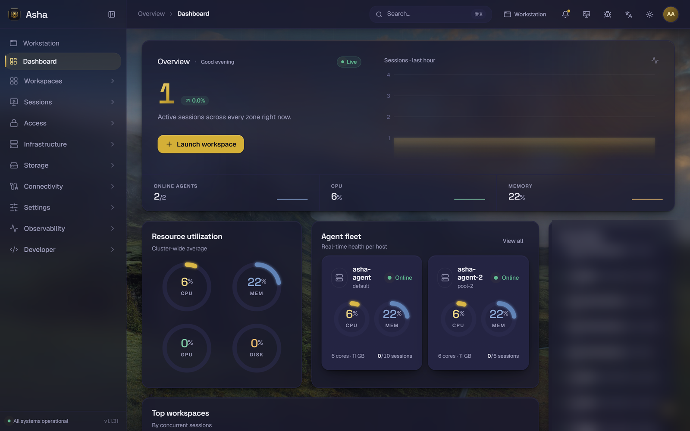
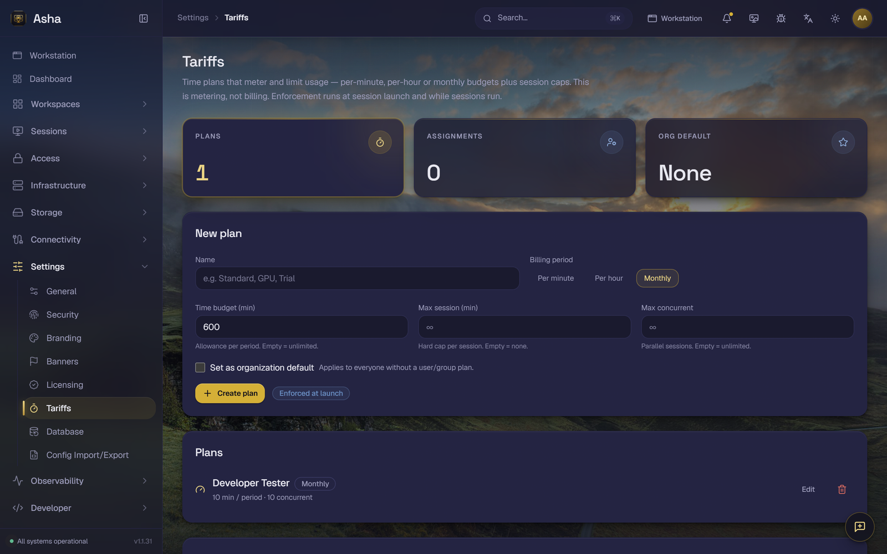

<div align="center">


# Asha

**Stream containerized desktops, browsers & apps to any browser.**
Self-hosted · multi-tenant · a modern container-streaming / VDI / DaaS platform.

**A [Naiemi Group](https://github.com/Kalin0x0) product** · `anthracite #1a1a2e` · `gold #d4af37`

<br>

[](LICENSE)
[](TODO.md)
[](TODO.md)
[](https://github.com/sponsors/Kalin0x0)

[](https://www.typescriptlang.org/)
[](https://nextjs.org/)
[](https://nestjs.com/)
[](https://www.prisma.io/)
[](https://www.docker.com/)
[](https://kubernetes.io/)
[](https://pnpm.io/)
[](https://turbo.build/)

</div>

> [!NOTE]
> **Asha is original, from-scratch software by Naiemi Group** — inspired by the feature set of
> commercial container-streaming products (Kasm Workspaces and the like), but **not** a copy of any
> proprietary codebase. Where genuinely open-source streaming/runtime components exist (KasmVNC,
> noVNC, Neko, Squid, WireGuard, guacd, Fluent Bit), Asha consumes them as **unmodified runtime
> container images or generated config** — never linked into our source, so licenses stay clean.

> [!TIP]
> **The name.** *Asha* comes from the Zoroastrian / Old-Persian tradition, where it means **truth,
> cosmic order and righteousness** — the principle that keeps the world running as it should. It's a
> fitting name for a platform whose job is to deliver clean, ordered, trustworthy workspaces, and it
> continues the project's Persian naming family.

<br>

<!--
  ✦ Screenshot gallery — drop your own PNGs into docs/brand/ and uncomment.
    (Left blank until then so the README never renders a broken image.)

<div align="center">
<table>
  <tr>
    <td align="center" width="50%"></td>
    <td align="center" width="50%"></td>
  </tr>
  <tr>
    <td align="center" width="50%"></td>
    <td align="center" width="50%"></td>
  </tr>
</table>
</div>
-->

## Contents

- [✨ Features](#-features)
- [🏗 Architecture](#-architecture)
- [🚀 Quick start](#-quick-start)
- [🧰 Scripts](#-scripts)
- [🗺 Roadmap](#-roadmap)
- [💛 Support this project](#-support-this-project)
- [📜 License & ownership](#-license--ownership)

## ✨ Features

Built from scratch or on open-source tooling — **nothing derived from any proprietary product.**

### Streaming & protocols

| | Feature |
| --- | --- |
| 🎥 | **KasmVNC** (HTTPS iframe) **and** WebRTC/H.264 via **Neko** as a first-class protocol. |
| 🖥 | **Remote protocols** — RDP/VNC through **guacd**, SSH through **ssh2** (full PTY, resize, key/password auth). |
| ⚡ | **GPU encoding** — hardware H.264 via NVENC (nvidia-container-runtime) or VAAPI (DRI render node), wired into both Docker and Kubernetes drivers. |
| ⏯ | **Session control** — pause/resume (container freeze), live resize, multi-monitor resolution selector in the viewer. |
| 🎛 | **Device passthrough** — webcam / USB / smartcard into the session container (Docker `Devices`, Kubernetes `CharDevice`). |
| 🧩 | **Connectivity sidecars** — Squid (web filtering), WireGuard (egress), Neko (browser isolation), PulseAudio (audio), CUPS (printing) — auto-launched with sessions and torn down with them. |

### Identity & access

| | Feature |
| --- | --- |
| 🔑 | **Passkeys / WebAuthn** — passwordless, phishing-resistant sign-in on `@simplewebauthn/server`, with clone detection. |
| 🪪 | **SSO** — OIDC (Auth Code + PKCE, JWKS ID-token verification, nonce-binding, RP-logout), SAML 2.0 (SP-initiated + Single Logout), LDAP bind + live-test, with JIT provisioning & attribute→group mapping. |
| 🔄 | **SCIM 2.0** — automated user + group provisioning (RFC 7643/7644) for Okta, Azure AD, OneLogin. |
| 🛡 | **Multi-tenancy & RBAC** — 40+ Prisma models, permission matrix, app-layer org scoping + Postgres RLS backstop. |
| 👤 | **Self-service profile** — photo, name, e-mail, password & TOTP two-factor, plus a live plan-&-usage view. |
| ⏱ | **Tariffs & isolation** — time budgets (per-minute/hour/month) metered & enforced, deny-by-default workspace visibility, and a one-shot **10-minute demo** account. |

### Operations & scale

| | Feature |
| --- | --- |
| 🗂 | **DLP enforcement** — per-workspace clipboard/upload/download/printing/audio/PWA policy, enforced in the viewer. |
| 📼 | **Sessions** — sharing + live chat, S3 recording, idle/max-duration reaper, forensic watermarking + compliance banner. |
| 🏷 | **Licensing & marketplace** — CONCURRENT / NAMED_USER enforcement, image-registry CRUD + one-click workspace install. |
| ☁️ | **VM matrix** — real drivers for **all eleven** backends: Proxmox, AWS, Azure, GCP, vSphere, DigitalOcean, Oracle OCI, OpenStack, Nutanix, KubeVirt, Harvester. |
| 📊 | **Ops & compliance** — SIEM log forwarding (Fluent Bit: syslog/Splunk/ES/Loki/HTTP), automated `pg_dump` backups, HMAC webhooks + reporting, AES-256-GCM secret-sealing at rest. |
| 🚢 | **Deploy** — single-node Docker Compose (Traefik, Postgres, Redis, guacd) **and** a Helm chart with the Kubernetes agent DaemonSet, session namespace, RBAC & HPA. |

## 🏗 Architecture

```
                           ┌──────────────────────────────────────────────┐
   Browser  ──https──►     │  Traefik (edge + per-session dynamic routing) │
                           └──┬─────────┬─────────────┬──────────────┬─────┘
                              │         │             │              │
                   ┌──────────▼──┐ ┌────▼──────┐ ┌────▼───────┐ ┌────▼──────────────┐
                   │ web (Next)  │ │ api (Nest)│ │ connection │ │ session container │
                   │admin+portal │ │Manager/API│ │   proxy    │ │ KasmVNC | Neko    │
                   └─────────────┘ └──┬───┬────┘ │RDP/VNC/SSH  │ │ + sidecars:       │
                                      │   │      └──┬──────────┘ │ Squid/WireGuard   │
                              ┌───────▼┐ ┌▼──────┐  │ guacd/ssh2 └──────▲────────────┘
                              │postgres│ │ redis │◄─┘                   │ docker / k8s
                              └────────┘ └───┬───┘            ┌─────────┴───────────┐
                                             └────────────────│ agent (dockerode /  │
                                              provision/destroy│   @kubernetes)      │
                                                               └─────────────────────┘
```

TypeScript end-to-end · pnpm + Turborepo monorepo.

| Workspace | Path | Purpose |
| --- | --- | --- |
| `@asha/web` | `apps/web` | Next.js 15 admin dashboard **and** end-user portal (the showpiece). |
| `@asha/api` | `apps/api` | NestJS Manager/API — REST + WebSocket control plane, OpenAPI at `/api/docs`. |
| `@asha/agent` | `apps/agent` | Provisions & destroys session containers — Docker (dockerode) **or** Kubernetes driver, plus connectivity sidecars + device passthrough. |
| `@asha/connection-proxy` | `apps/connection-proxy` | RDP/VNC bridge to **guacd**, SSH bridge via **ssh2** (PTY, resize, key/password auth). |
| `@asha/db` | `packages/db` | Prisma schema (single source of truth), client, seed, RLS backstop. |
| `@asha/contracts` · `@asha/rbac` | `packages/*` | Shared DTOs / zod schemas / event contracts · permission catalog + role matrix. |
| `@asha/proxy-labels` · `@asha/events` | `packages/*` | Session → Traefik labels / k8s ingress · typed Redis pub/sub channels. |
| `@asha/config` · `@asha/crypto` · `@asha/logger` | `packages/*` | Env loading · secret/token crypto · structured logging. |

## 🚀 Quick start

### One command on Ubuntu — the branded installer

Take a bare Ubuntu/Debian box to a **live, signed-in-ready** Asha in one line. The installer greets
you with the Asha mark, then handles Docker, strong secrets, your **domain + TLS**, the full stack,
and the database migrate + seed:

```bash
curl -fsSL https://raw.githubusercontent.com/Kalin0x0/Asha/main/scripts/install.sh | sudo bash
```

<details>
<summary>What you'll see</summary>

```
==============================================================================

                            ######  ######
                        ####      ##      ####
                      ###    ##########    ###
                     ##    ####      ####    ##
                    ##    ##    ####    ##    ##
                    ##    ##   ##  ##   ##    ##
                    ##    ##    ####    ##    ##
                     ##    ####      ####    ##
                      ###    ##########    ###
                        ####      ##      ####
                            ######  ######

         _    ____  _   _    _
        / \  / ___|| | | |  / \
       / _ \ \___ \| |_| | / _ \
      / ___ \ ___) |  _  |/ ___ \
     /_/   \_\____/|_| |_/_/   \_\

              C O N T A I N E R   S T R E A M I N G

==============================================================================

  Naiemi Group  ·  VDI / DaaS Platform                       Installer  v1.0.0
```

From a clone, or non-interactively:

```bash
sudo bash scripts/install.sh                                   # interactive menu
sudo bash scripts/install.sh --domain asha.example.com \
     --email ops@example.com --yes                             # unattended
```

The installer is also your control panel: `status` · `logs` · `restart` · `update` · `uninstall`.
</details>

**Full guide → [`docs/INSTALL.md`](docs/INSTALL.md).**

### Option A — the UI showpiece only (no Docker, fastest)

The web app runs fully on deterministic mock data (`NEXT_PUBLIC_API_MODE=mock`).

```bash
pnpm install
cp .env.example .env
pnpm --filter @asha/web dev
# open http://localhost:3000  → login with any credentials (mock mode)
```

### Option B — the full stack (Docker)

```bash
cp .env.example .env
docker compose up -d --build
# web:      https://asha.local        (add `127.0.0.1 asha.local` to your hosts file)
# api docs: https://asha.local/api/docs
```

The `db-migrate` one-shot container syncs the schema with `prisma db push` and runs the idempotent
seed automatically. Default admin credentials are printed by the seed (see `packages/db/prisma/seed.ts`).

### Local dev against a real API

```bash
pnpm install
docker compose up -d postgres redis traefik   # infra only
pnpm db:migrate && pnpm db:seed
pnpm dev                                        # turbo runs web + api + agent
# set NEXT_PUBLIC_API_MODE=live in .env to call the real API
```

## 🧰 Scripts

| Command | What it does |
| --- | --- |
| `pnpm dev` | Run web + api + agent in watch mode (Turbo). |
| `pnpm dev:web` | Just the Next.js app (mock mode → no backend needed). |
| `pnpm build` | Build every workspace. |
| `pnpm typecheck` | Type-check every workspace. |
| `pnpm db:migrate` / `db:seed` / `db:studio` | Prisma lifecycle. |
| `pnpm test` | Unit + e2e tests. |

## 🗺 Roadmap

All seven phases are complete — **276 unit tests**, full `typecheck · lint · test · build` green
across 26 workspace tasks. The per-item build log lives in [`TODO.md`](TODO.md).

<details>
<summary>Phase-by-phase build log</summary>

- ✅ **Phase 1** — monorepo, full data model, the Asha design system, admin shell + live dashboard + sessions, the end-user **launch → stream** flow against a real KasmVNC container, single-node Docker Compose, Helm skeleton.
- ✅ **Phase 2** — RDP/VNC via guacd + SSH via ssh2, session sharing & chat, recording (S3), persistent profiles & file mappings, TOTP 2FA.
- ✅ **Phase 3** — full OIDC/SAML/LDAP, multi-zone + staging + casting, server pools + autoscale + VM/DNS providers (real Proxmox VE driver), security hardening, reporting/webhooks.
- ✅ **Phase 4** — storage mappings, browser isolation / web filtering / egress, Kubernetes driver + HPA, Windows/RDS.
- ✅ **Phase 5** — session reaper, forensic watermarking, SIEM log forwarding, automated backups, DLP, WebRTC/H.264 (Neko), device passthrough, connectivity sidecars wired into provisioning.
- ✅ **Phase 6** — session pause/resume/resize + multi-monitor, GPU encoding (NVENC/VAAPI), runtime DLP enforcement (agent + viewer), PulseAudio + CUPS sidecars, full SAML SP-initiated flow + LDAP bind/live-test with JIT provisioning, license enforcement, image-registry marketplace, drag-and-drop upload, mobile/touch-optimized viewer.
- ✅ **Phase 7** — enterprise identity, the full VM driver matrix, and at-rest secret hardening: **WebAuthn / passkeys**, **SCIM 2.0**, **OIDC** Auth Code + PKCE with JWKS verification, nonce-binding & RP-initiated logout, **SAML Single Logout**, eleven real VM-provider drivers, **AES-256-GCM secret-sealing at rest** for every provider/auth-config/webhook secret, and a **complete admin surface** — every navigation item is a live page wired to its backend.

</details>

## 💛 Support this project

<div align="center">

[](https://github.com/sponsors/Kalin0x0)
[](https://github.com/sponsors/Kalin0x0)
[](https://ko-fi.com/kalin0x)

</div>

Asha is built in the open by **[Naiemi Group](https://github.com/Kalin0x0)**. If Asha saves you time,
powers your workspaces, or you'd simply like to see it grow, **your support keeps the containers
streaming** ✨. Every sponsorship goes straight into development, demo hosting, and the next batch of
features. Thank you 🙏

The best way to support Asha is **GitHub Sponsors** — one-off or monthly, cancel anytime:

<div align="center">

### **[→ Sponsor Asha on GitHub](https://github.com/sponsors/Kalin0x0)**

</div>

More platforms activate automatically from [`.github/FUNDING.yml`](.github/FUNDING.yml) — see the
[Sponsoring guide](docs/SPONSORING.md).

> ⭐ Not able to donate? **Starring the repo** and sharing Asha helps just as much — it's free and it
> genuinely moves the needle. New here? The [installation guide](docs/INSTALL.md) gets you a live
> Asha in one command.

## 📜 License & ownership

Asha is a **Naiemi Group** product, released under the [MIT License](LICENSE). All first-party source
in this repository is owned by Naiemi Group. Third-party open-source runtime images and tools
(KasmVNC, Neko, Squid, WireGuard, guacd, Fluent Bit, Traefik, Postgres, Redis) are used **unmodified**
under their respective licenses and are never linked into Asha's source.

<div align="center">
<br>

[](https://star-history.com/#Kalin0x0/Asha&Date)

<br>

— built by **[Naiemi Group](https://github.com/Kalin0x0)** —

</div>
